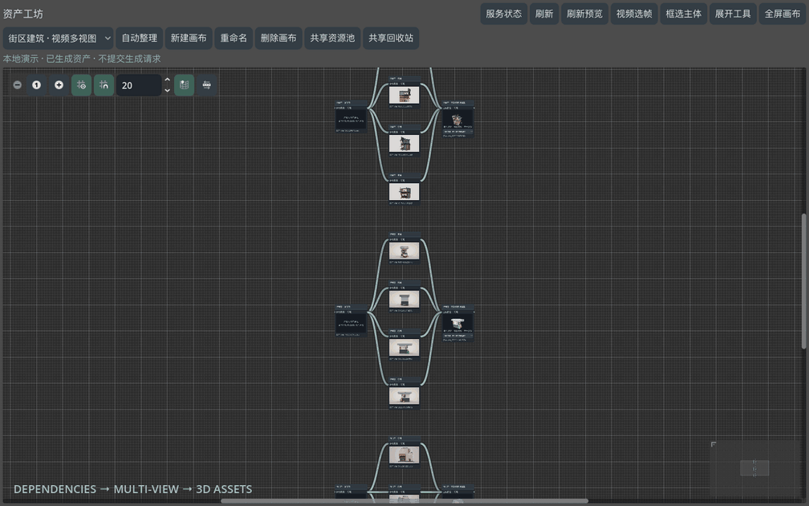

# Godot Asset Pipeline · 资产工坊

把概念图、主体图、三视图和 3D 模型放进同一条可追溯的生产链。原生 Godot 编辑器插件，Python 后台，Tripo API，附 MCP 与 Codex Skill。**生成结果直接入库，摆放到场景后再判断质量；局部重做保留历史。**

## 演示



真实插件界面的离线演示回放：展示已生成建筑的视图依赖、资产卡片和 GLB 旋转预览。不是实时生成耗时展示；演示不提交 API 请求。

## 架构选择

```text
Godot 原生 GraphEdit 面板          Codex + 配套 Skill
          │                        │ MCP stdio
          └── 带令牌的本机请求 ──────┘
                       │
                 Python 后台
             依赖图 / SQLite / 作业恢复
                       │
           官方 Tripo 客户端（CLI 0.5.1）
                 Tripo Developer API
                       │
                按版本保存的产物
                       │
        Godot 场景实例 / 原生撤销 / Scene Bridge
```

Godot 面板使用 GDScript `EditorPlugin`。Python 作为独立后台进程，不要求给 Godot 安装非官方 Python 语言绑定。这一版不用 LangGraph：资产依赖、历史版本、失效传播属于生产数据；LangGraph 的执行检查点不能代替这些。以后若增加自主规划、多代理审查，可以放在 MCP 上层。

依据：[Godot 插件](https://docs.godotengine.org/en/stable/tutorials/plugins/editor/making_plugins.html)、[官方支持语言](https://docs.godotengine.org/en/stable/about/faq.html#which-programming-languages-are-supported-in-godot)、[LangGraph 持久化](https://docs.langchain.com/oss/python/langgraph/persistence)。

## 已实现

- 编辑器顶部「资产工坊」主屏幕：带图片/3D 预览的依赖图、提示词、JSON 参数、版本与产物、任务记录。
- 每个节点显示当前版本的真实产物；3D 模型可直接拖动旋转、滚轮缩放、双击复位，右侧详情也支持同样操作。状态刷新保留预览角度。
- 右侧「依赖资产」显示上游图片/模型、用途、版本和变化提示；可对比当前依赖与所选产物实际记录的历史输入，并定位上游节点。
- 新建任意主体分支、连接/断开依赖、拖动节点、三视图模板。
- 任意阶段直接导入本地结果；保存原始提示词、参数、输入版本、文件哈希、供应商任务 ID 和消费记录（服务返回时）。
- 一次提交主体清单，预先展开主体图、三视图、模型的完整节点；启动批次后后台自动按依赖生成，产物逐项入库。
- 批次可用 `image_reference_inputs` 一次指定公共图片依赖，例如概念视频末帧；后台将其追加到新主体图与各个视图的实际生图输入，保留原参考顺序。3D 阶段仍只接收单体视图。
- 连接期间每 2 秒同步，包括外部脚本新建的批次和节点；顶部显示并核对项目、批次进度、当前阶段与错误，提供整批开始/暂停/继续，保留预览角度和未保存草稿。
- 修改上游只标记后代过期；普通节点编辑不启动生成。批次执行只处理明确提交的资产范围。
- 旧版本可切换；生成中修改配方，旧请求完成后保留历史而不覆盖当前结果。
- Tripo 文生图、多参考图编辑、单图多视图、多视图生成模型；P2 面数、拓扑、贴图与种子参数。
- 非阻塞任务、持久化 ID、继续查询、对提交结果不明确的任务禁止自动重发。
- 模型直接放入当前 3D 场景；更新选中实例时保留包装节点的变换和手工子节点，原生撤销/重做，不自动保存场景。
- 18 个 MCP 工具，和面板共用同一数据库；批次创建、计划、运行、暂停和继续可通过 MCP 或脚本调用。

## 安装

需要 Godot 4.7（本机已在 4.7.2 验证）、Python 3.9+、Node.js 20+ 与 **tripo-cli 0.5.1**。版本固定是为了保证付费提交的重试行为；CLI 升级后插件会明确报不兼容，不会悄悄换调用方式。

1. 把 `addons/asset_pipeline` 复制到任意 Godot 项目的 `addons`。也可运行：
   ```sh
   python3 tools/install.py --project /absolute/path/to/godot-project
   ```
2. Godot → 项目设置 → 插件 → 启用「AI 资产管线」。顶部出现「资产工坊」。
3. 后台自动启动。Python 找不到时，在编辑器设置 `asset_pipeline/python_executable` 填写解释器完整路径。
4. 生成前安装并登录官方 CLI：`npm install -g tripo-cli@0.5.1`，随后 `tripo login` 在浏览器授权。不要把密钥放进项目或聊天。已有授权可以复用。

Tripo Studio 会员积分与 API 积分分开。本地浏览、导入、编辑依赖、计划预览和版本切换不提交生成任务。

## 使用

1. 导入总概念图。Codex 识别一次主体，提交主体清单和各阶段提示词。
2. `batch.create` 一次性建立完整依赖图，尚未生成的阶段也会显示在工坊中。数据格式见 [批次契约](skills/godot-asset-pipeline/references/batch.md)。
3. 查看整批计划后启动批次。后台自动完成主体提取、各个视角、模型生成与入库；中间不需要 Codex 点击下一步或逐张审查。
4. 工坊持续显示生成状态、图片和可旋转模型。可以切换界面；后台任务不依赖聊天继续响应。
5. 整批完成后统一检查，选择模型版本并放入场景。失败环节保留输入和任务 ID，其他独立主体可以继续完成。
6. 局部修复仍可选中单个节点，修改提示词并运行该节点。切换旧版本不会自动更新场景实例。

自动模式使用 Tripo 的图片与模型 API。内置聊天生图是单独的交互模式，后台脚本不能直接调用它。已有外部图片可以在批次清单中指定为复用产物，保留实际来源与提示词，避免重复计费。

概念视频可以先提取最后可解码帧并导入参考节点。当它需要共同指导主体提取和三视图时，在批次清单填写 `"image_reference_inputs": [{"node_id": "末帧参考节点ID", "role": "layout_reference"}]`，并在各阶段提示词中说明这张图负责结构、朝向和相对比例，原图与主体图负责外观身份。已有节点和历史产物不会被批次公共输入自动改写；显式修改当前配方后，旧产物保留真实输入记录并标记过期。

批次进度统计去重后的生产阶段，额外导入的静态参考资料不计入总数。新批次自动加入画布；点击「查看批次」可定位整条链路，不会在后续刷新时改变当前视角。暂停停止本地调度和轮询，已经提交的远端任务可能继续运行和计费；继续时使用已有任务 ID，不自动重发失败或结果不明确的提交。

一次脚本调用示例（`--run` 会使用 API 积分；不加则只预建和查看计划）：

```sh
python3 tools/run_batch.py --project /absolute/path/to/godot-project --spec asset-brief.json --run --wait
```

### 节点预览

- 概念图、主体和各个视图直接显示在节点卡片上。一个版本包含多个图片/模型时，可用卡片下方的文件下拉框切换。
- 在模型画面内按住左键拖动以旋转视角，滚轮缩放，双击恢复完整模型；拖动节点标题可移动整个节点。
- 点击「查看全链路」让全部节点进入画布；图形的缩放和平移沿用 Godot GraphEdit 操作。
- 在右侧「版本与产物」切换历史版本，节点预览同步更新。图片或模型缺失时显示原因，不用空白代替。
- 预览使用独立的 3D 世界与相机，操作不会修改项目场景。只有画面变化时才重绘；后台轮询复用现有预览。

### 查看依赖资产

选中节点后，右侧顶部显示它的直接上游资产。模型节点会展示相连的各个视角，图片节点会展示其参考图。每张卡片包含真实预览、输入用途和版本；一个上游含多个文件时可以切换，3D 预览沿用旋转和缩放操作。

- **当前依赖**：当前配方下一次运行会读取的上游版本。上游更新、过期或尚无产物时会明确提示。
- **本版本使用**：当前选中输出生成时记录的依赖与版本。即使后来修改连线或更新上游，仍显示原始输入；缺失历史记录时不会用最新文件冒充。
- **定位节点**：选中并居中对应上游节点，不修改它的当前版本或触发生成。当前提示词/参数有未保存修改时，会先提示保存，防止跳转丢失编辑。

图片编辑支持多参考图。front/right/back 语义保存在依赖角色和提示词中；图片参数只填写供应商支持的字段。三个视角是独立图片，不应拼成一张再冒充多输入。`model`、`multiview` 端点不接受额外自由提示词，相关提示应放在上游图片节点。

### 示例

`tools/seed_newsstand.py --project ...` 可导入此前本地制作的报刊亭素材：真实截图、主体、正面/右侧/背面、完整提示词、H3.1 与 P2 两个模型版本。该脚本需要原项目现有素材，不下载也不生成。历史由 Studio 和内置生图工具产生，记录明确标明来源，没有伪装成新 API 请求。插件源码包不包含第三方游戏截图和派生模型。

### 完成后检查模型

独立检查工具在临时空项目中加载本地 GLB，输出正面、右侧、背面三张正交预览，以及包围盒、三角面、网格、材质、贴图统计和处理前后文件哈希。不修改模型或当前编辑器场景，也不调用生成 API。

```sh
python3 tools/run_asset_review.py --godot /path/to/Godot --output-dir /absolute/review /absolute/model.glb
```

渲染会打开独立 Godot 窗口，需要可用的图形环境。薄地形等资产可加 `--extra-views` 输出俯视和三分之四视图。批量模型可通过 `--manifest` 指定；`front_axis` 默认为 `+z`，表示约定的观察方向，不自动识别模型语义正面。包围盒保留原始模型单位；该工具不进行尺寸归一化或自动美术验收。

## MCP 与 Skill

MCP 服务启动命令：

```sh
python3 /absolute/project/addons/asset_pipeline/backend/server.py --project /absolute/project --mcp
```

保持该项目的 Godot 插件启用，或单独运行同一命令去掉 `--mcp` 启动后台。MCP 本身不会隐式启动另一份调度器。把 `skills/godot-asset-pipeline` 放到 Codex 的 skills 目录。场景编辑沿用 Godot Scene Bridge；本插件不重复实现任意节点编辑能力。

诊断（纯本地）：

```sh
python3 addons/asset_pipeline/backend/server.py --project /absolute/project --call snapshot
python3 addons/asset_pipeline/backend/server.py --project /absolute/project --call provider.status
```

18 个 MCP 工具覆盖 snapshot、provider_status、create_node、update_node、plan、run、import、select_version、resume、pause、attach_task、template、record_instance，以及 create_batch、plan_batch、run_batch、pause_batch、resume_batch（均带 `asset_pipeline_` 前缀）。单作业暂停停止本地轮询；批次暂停同时停止该批次的新阶段调度，远端任务可能继续计费。服务可通过 RPC `shutdown` 关闭；再次启用插件会恢复连接，已有远端任务可继续查询。

## 文件与恢复

- `.asset_pipeline/state.sqlite3`：生产数据库。和 `assets/asset_pipeline/` 一起备份可保留历史。
- `assets/asset_pipeline/<node>/<version>/`：不可变产物副本。更换版本不会覆盖旧文件。
- `.godot/asset_pipeline_connection.json`：本机临时连接信息与随机令牌，0600 权限，不进版本库。
- `.godot/asset_pipeline/server.log`：后台诊断日志。

服务只监听 127.0.0.1，拒绝浏览器 Origin，不提供通用脚本执行。文件完整性/路径检查用于正确读写，不属于美术质量审批。自动下载失败时保留任务 ID，继续原任务即可。

图片提交在同一项目后台内共享一个并发槽，覆盖批次及单节点任务；批次 `concurrency: 2` 不会同时提交两张图片。已暂停查询的远端图片任务仍占槽，已有任务 ID 可继续查询，未知提交结果须先处理。这个本地限制不能约束另一个项目或网页使用同一账户发起的任务。

供应商拒绝时保留经过校验的 HTTP 状态、API 错误码及请求 ID，不保存远端原始错误文本。修正问题后，可显式调用 `asset_pipeline_retry_rejected_batch`（后台 `batch.retry_rejected`，参数 `batch_id`、`node_ids`、`reason`）准备恢复：仅接受没有远端任务 ID 的明确 HTTP 400/429 拒绝，400 还要求更改请求。配方更改须先建一个采用原节点的恢复批次。此操作只记录新的尝试及 `retry_of`，随后运行批次才会提交；历史失败、已成功版本和未知提交不会被覆盖或自动重购。

## 当前边界

- 付费在线生成需要账户余额与供应商服务可用。自动化测试不提交付费任务；测试结果与在线生成记录分别见 [验证记录](VALIDATION.md)，不能把离线接口契约测试称为在线生成成功。
- 默认三角面 GLB 便于直接入库和放置。Tripo 四边面可能返回 FBX/外部贴图/ZIP；插件保留下载产物，但暂未实现贴图包目录还原和 FBX→自包含 GLB 转换。此类资产需手工处理后重新导入。
- 节点图支持任意分支。自动识别概念图里所有主体、判断视觉质量和场景布局由 Codex/Skill 负责；后台不是另一个常驻自主思考 Agent。
- 已支持一次启动批次内的全部生产阶段；暂不支持任意已编辑图的一键重建全部后代、节点删除/整图 Undo、纹理专用再生成节点、精确批量报价或自动更新全部场景实例。
- 版本文件不可变；当前配方与手动选中的历史版本可以不同，预览计划显示将用于下一次请求的配方。实例数据库是上次操作记录，原生场景 Undo 后以节点元数据为准。

## 验证

```sh
python3 -m unittest discover -s tests -v
python3 tests/run_batch_ui_probe.py --godot /path/to/Godot
```

0.2.0 本地验证：92 项 Python 测试、35 项 Godot 批次 UI 检查，以及使用外部测试素材的 84 项无窗口图片/GLB 预览检查通过。包含真实 SQLite 并发/恢复、完整批次调度与暂停恢复、分支失效、任务去重、旧结果保护、HTTP/MCP 子进程通信、官方 Tripo 请求构建器与无重试行为。运行环境与复现方法见 [验证记录](VALIDATION.md)。官方文档：[多参考图编辑](https://developers.tripo3d.ai/en/docs/generation-image-to-image)、[P 系列多视图建模](https://developers.tripo3d.ai/zh/docs/generation-multiview-to-model/p)。

真实在线批次已完成 14 / 14：复用 12 个阶段，后台自动生成并入库街机店、拉面店两个 P2 模型，新增消耗 220 credits；Godot 面板无需手动刷新即可显示进度。本轮没有重新生成图片，在线图片 API 的完整新生产链仍需单独验证。详见 [在线记录](VALIDATION.md#真实在线批次)。

2026-09-25：共享布局图片依赖、图片并发限制及显式拒绝恢复补充验证，完整 Python 测试共 109 项通过。该结果是本地功能验证，不代表供应商已接受所有在线请求。

### 视频选帧（本地，不调用付费生成）
资产工坊顶部 → 视频选帧 → 选择视频 → 均匀抽帧。默认 20 帧，可设 4–100 帧，包含首尾；短视频不会重复抽同一帧。每张候选图可查看原图并标记为正面、左侧、背面、右侧；方向唯一，重新指定自动替换。必须选正面及至少一个其他方向。
确认后创建源视频参考节点、带帧号/时间/源文件哈希的图片参考节点和连接好的模型节点；不会自动提交 Tripo。相同会话相同选择重复确认不会重复创建。改变选择会保留旧链路并创建新链路。原视频和候选帧保存在 artifacts/asset_pipeline_video。
macOS 可用 Swift/AVFoundation；其他平台需安装 ffmpeg 与 ffprobe。超过解码时限会报告失败，可先裁剪视频再试。HTTP 方法：video.sample（path,count）、video.commit（session_id,selection,label），selection 使用零起始帧号与 front/left/back/right 角色。

### 手动画布工作流
- 顶部「导入资源」支持多选；Godot 文件资源也可以拖到面板导入。导入会创建节点并保存产物版本。
- 「节点操作」（也可画布右键）支持重命名、复制选中节点、复制下游分支、归档/恢复。归档不删除磁盘文件，面板显示直接依赖者。
- 「编辑依赖」可选择/导入资产，修改正面/左侧/背面/右侧等角色，调整顺序、替换和移除；后台拒绝循环依赖。连线会打开此编辑器，明确角色后保存。
- 版本下拉框只预览；「采用正在预览的版本」才切换生效版本。支持当前版本与预览版本并排对照。
- 「常用参数表单」提供模型版本、方向、面数、种子、贴图等字段；应用后需保存。高级参数仍可使用 JSON。
- 「节点操作」里的重生成预览列出范围，再创建独立修复分支；点击批次「整体开始」才提交生成。原节点与版本保留。
- 框选节点可保存自定义模板并重新添加。模板保存配方/连线，不打包产物；外部依赖在同项目仍存在时沿用。
- 「当前节点作业管理」支持暂停/继续已有任务以及对未知提交关联已核实的远端任务 ID。
- 「撤销/重做」覆盖本次后台会话内的手动建节点、导入建节点、配方/依赖/位置修改、复制与归档。新增节点的撤销采用归档；不撤销付费任务、已生成文件或采用版本操作。后台重启后历史清空，冲突修改或未完成任务阻止撤销。
- 视频选帧中的「历史选帧」恢复候选帧与方向标记；改变选择会建立新链路，保留旧链路。

验证：`python3 -m unittest discover -s tests -p 'test_*.py'`；Godot `--headless --script res://tools/check_manual_ui.gd`。

### 框选主体
顶部「框选主体」打开参考图，默认使用当前所选节点正在预览的图片版本。拖出矩形，拖框内移动、拖四角缩放；支持五种快捷颜色与任意自定义颜色。点击「创建主体节点」无需填写名字、位置或提示词。
插件保留未修改原图、生成带框参考图，按「原图、带框图」顺序连接主体节点，自动填写统一抽取提示词。两张参考图均入库为独立版本，记录源节点/源版本、像素坐标、图片尺寸和框线颜色。原图后续换版不会偷偷改变已经选定的输入。创建节点不调用付费 API；选中新主体后使用已有运行入口生成。一次框选一个主体，可反复创建多个主体。


### 多画布与共享资产

顶部支持命名新建、切换、重命名和删除画布。旧项目首次更新时，现有节点与位置迁入“默认画布”。至少保留一张画布。

- 每张画布独立保存卡片位置；同一资产可从“共享资源池”加入多张画布，不复制文件，提示词、版本与依赖仍然共享。
- “仅从当前画布移除”只移除摆位；“删除共享资产”会让资产在所有画布进入共享回收站。
- 删除画布保留资产文件、生成历史及依赖，可从共享资源池重新加入；画布创建、重命名、移动、删除支持当前后台会话内撤销/重做。
- 编辑画布时 Ctrl+Z / Command+Z 撤销，Ctrl+Shift+Z / Command+Shift+Z 或 Ctrl+Y 重做。文字输入保留文本自身撤销。
- 画布与摆位存于 `.asset_pipeline/state.sqlite3`，当前画布选择存于 `.godot/asset_pipeline_canvas.cfg`。

视频资产支持 MP4/MOV/MKV/WebM/AVI/OGV 卡片入口：“播放视频”使用系统播放器；“视频选帧”和顶部同名按钮自动带入当前视频。切换视频会清除上一视频的帧标记，避免误用旧帧。


### 视频封面与依赖查看

导入视频后，画布、资产池和依赖面板自动显示第一帧封面；封面缓存在项目 `.godot` 目录，源文件变化后重新提取。macOS 使用 AVFoundation（需要 Swift），其他平台使用 FFmpeg。播放视频与手动选帧按钮仍然可用，不调用付费服务。

依赖菜单仅切换查看方式：**下次生成的输入**展示当前配置，**此版本生成时的输入**展示所选产物版本的历史记录；不会因切换菜单改变依赖。
